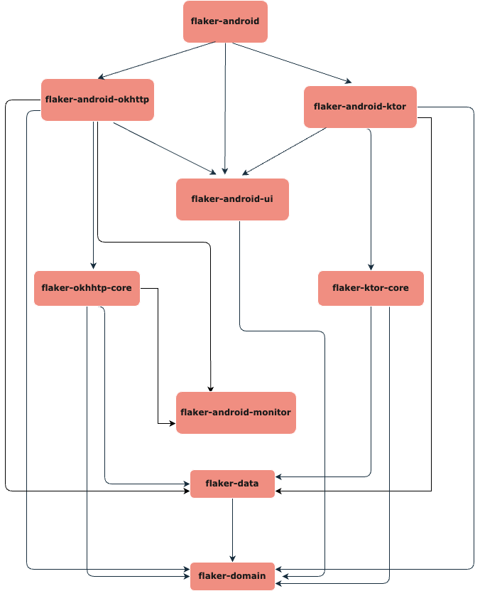

# :construction: Flaker :construction:


A flaky network simulator for your mobile app.

Imagine effortlessly recreating real-world network scenarios directly for your mobile app development. With Flaker,-  you gain the ability to mimic a variety of network conditions tailored for mobile app development. 
- **Experience Slow Networks**: Wondering how your app performs on a slow network? Flaker lets you replicate these scenarios, helping you fine-tune your app's responsiveness. 
- **Emulate Flaky Networks**: Use fail percentage and variance controls to mirror the unpredictable nature of network connections. Get a firsthand feel for the scenarios your mobile app might encounter. 
- **Focused Impact**: Flaker only affects your app's network conditions, leaving your device's overall network functionality undisturbed.

Whether you're a mobile app developer refining user experiences or a tester validating app resilience, Flaker offers an intuitive solution within your development workflow. Elevate your testing strategies and boost your app's performance with Flaker.

## Demo


## Getting Started

### Usage

#### flaker-android-okhttp
Add the following statement to your app's onCreate method.
```kotlin   

   class MainApplication: Application() {
       override fun onCreate() {
           super.onCreate()
           FlakerAndroidOkhttpContainer.install(this)
       }
   }
```

Then in your okhttp client builder, add the following interceptor.
```kotlin
    val client = OkHttpClient.Builder()
        .addInterceptor(FlakerInterceptor.Builder().build())
        .build()
```

That's it. Now you can use the companion app to simulate the network conditions.

## Development

### Library Code Map



### :hammer: Build
 Simply clone this repository in Android Studio Giraffe or above and build the project.

### Module Details
- **flaker-domain**: Contains domain of flaker library which is used by other modules. Like Network Request and preferences by the user.
- **flaker-data**: Contains data layer of flaker library which is used by other modules to get the locally stored data. All the persistent data should stay here.
- **flaker-okhttp-core**: Core module containing the functionality to intercept the network request and simulate the network conditions using OkHttp Interceptor.
- **flaker-ktor-core**: Core module containing the functionality to intercept the network request and simulate the network conditions using Ktor
- **flaker-android-ui**: Contains the reusable UI elements and components for the android companion app.
- **flaker-android-okhttp**: Contains the companion app which gets installed as a part of library. This should be used for the apps which uses OkHttp as their networking library.
- **flaker-android-ktor**: Contains the companion app which gets installed as a part of library. This should be used for the apps which uses Ktor as their networking library.
- **flaker-android**: Contains the companion app which gets installed as a part of library. This should be used for the apps which uses both okhttp and Ktor as their networking library.

### Verify
We use `detekt` for static code analyis and a job is setup in github actions to run it on every PR. You can run it locally using the following command:
```bash
// For android related changes
./gradlew detekt

// For iOS related changes
./gradlew detektMetadataIosMain

// For common code changes
./gradlew detektMetadataCommonMain
```

If you want to `detekt` to auto correct some of the stuff, please add the flag `--auto-correct` to the above commands.


## Roadmap
- [x] flaker-android-okhttp
- [ ] flaker-android-ktor
- [ ] flaker-ios-ktor

## Contributing
If you've found an error in this sample, please file an issue.

Patches are encouraged and may be submitted by forking this project and submitting a pull request. Since this project is still in its very early stages, if your change is substantial, please raise an issue first to discuss it.

## License
```
Copyright 2023 Rohan Maity

Licensed under the Apache License, Version 2.0 (the "License");
you may not use this file except in compliance with the License.
You may obtain a copy of the License at

    https://www.apache.org/licenses/LICENSE-2.0

Unless required by applicable law or agreed to in writing, software
distributed under the License is distributed on an "AS IS" BASIS,
WITHOUT WARRANTIES OR CONDITIONS OF ANY KIND, either express or implied.
See the License for the specific language governing permissions and
limitations under the License.
```