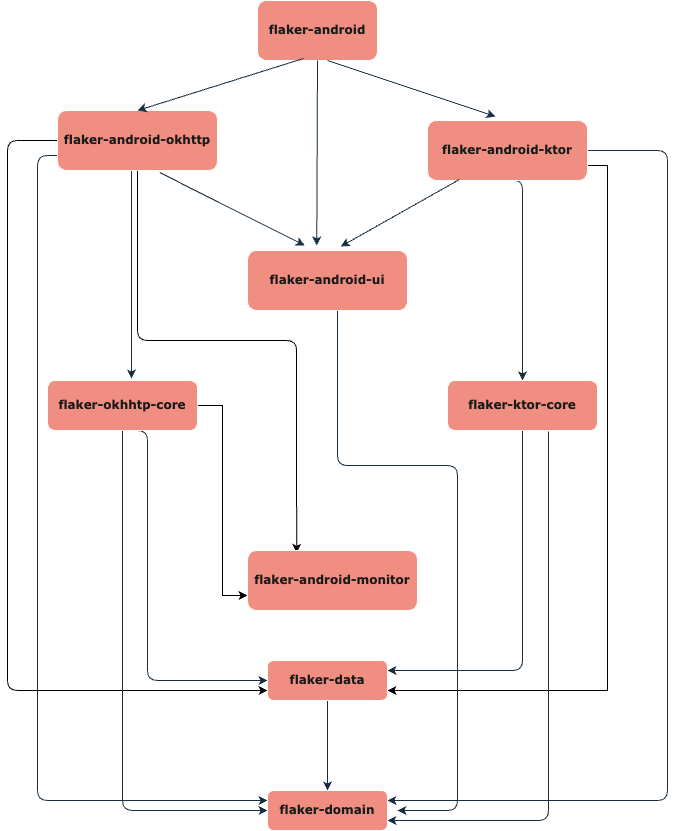

## Development

### Library Code Map



### 🛠️ Build
Simply clone this repository in Android Studio Giraffe or above and build the project.

### Module Details
- **flaker-domain**: Contains domain of flaker library which is used by other modules. Like Network Request and preferences by the user.
- **flaker-data**: Contains data layer of flaker library which is used by other modules to get the locally stored data. All the persistent data should stay here.
- **flaker-okhttp-core**: Core module containing the functionality to intercept the network request and simulate the network conditions using OkHttp Interceptor.
- **flaker-ktor-core**: Core module containing the functionality to intercept the network request and simulate the network conditions using Ktor
- **flaker-android-ui**: Contains the reusable UI elements and components for the android companion app.
- **flaker-android-okhttp**: Contains the companion app which gets installed as a part of library. This should be used for the apps which uses OkHttp as their networking library.
- **flaker-android-ktor**: Contains the companion app which gets installed as a part of library. This should be used for the apps which uses Ktor as their networking library.
- **flaker-android**: Contains the companion app which gets installed as a part of library. This should be used for the apps which uses both okhttp and Ktor as their networking library.

### Verify
We use `detekt` for static code analyis and a job is setup in github actions to run it on every PR. You can run it locally using the following command:
```bash
// For android related changes
./gradlew detekt

// For iOS related changes
./gradlew detektMetadataIosMain

// For common code changes
./gradlew detektMetadataCommonMain
```

If you want to `detekt` to auto correct some of the stuff, please add the flag `--auto-correct` to the above commands.